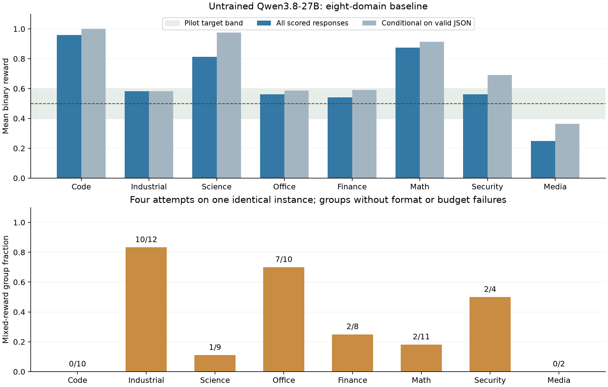

# Eight-domain baseline: measured learnability and diversity

One IridisX H200 completed **576 base-model responses** in 34 minutes 30 seconds: 384 on the training distribution and 192 on structural holdouts. There were **zero inference failures**. This is calibration of an untrained Qwen3.8-27B, not a GRPO training result.

The frozen controller revision is `ffe22c3132f664a55e1e8bd053700d1b4587e4afe0f1b3fcbbc9ba473a22b85a`. The [public aggregate](eight-domain-baseline.json) excludes model replies, example seeds, grader source and expected outputs.

| Domain | Reward mean, 48 training responses | Reward conditional on valid JSON | Mixed groups with no format/budget failures |
|---|---:|---:|---:|
| Code | 0.958 | 1.000 | 0/10 |
| Industrial | 0.583 | 0.583 | 10/12 |
| Science | 0.812 | 0.975 | 1/9 |
| Office | 0.562 | 0.587 | 7/10 |
| Finance | 0.542 | 0.591 | 2/8 |
| Math | 0.875 | 0.913 | 2/11 |
| Cybersecurity | 0.562 | 0.692 | 2/4 |
| Media | 0.250 | 0.364 | 0/2 |

Each measured group contains four attempts on one identical problem. Across all training groups, varied rewards occur in **42/96 (43.8%)**; among groups with no format or budget failures, **24/66 (36.4%)** vary. The pooled reward is **0.6432**, and formatting fails on 10.94% of responses. Conditional rates are diagnostic and do not replace overall performance. Small or all-pass samples have substantial population uncertainty even when a percentile bootstrap is degenerate.

The baseline achieves **8/8 domain coverage**, an effective domain count of **8.0**, **24/24 cells**, and an effective cell count of **24.0**. Its visible inputs contain 33 structural schema profiles. The recorded 243 attempted tool transitions include failed operations and should not be optimized as a reward. These coverage measures do not establish transfer.

The 192 structural holdouts score **0.5990**, with an instance-cluster bootstrap interval of approximately **0.500–0.693**. Inputs change physical relationships, scheduling structure, currencies, sites, units and delivery formats. The fixed design matches levels across splits, but it is a small base-capability measurement, not evidence of improvement from training. Holdout results were excluded from sampler fitting.

Independent per-domain optimization marks code, science and mathematics as unable to reach a predicted 0.5 under the exploration floors. A pooled mean near 0.5 would also conceal finance's low same-instance variation. Reweighting alone cannot repair those problems.

The next candidate therefore adds resource-constrained repository repair, exact blocked randomization analysis with controlled evidence changes, deeper batched exact proofs, incremental caption and policy edits, bounded local helper execution and eight-instance coverage blocks. Every fresh outcome predicate remains mandatory. This is a separate redesigned candidate; the baseline results have not been relabeled. Its calibration uses new training and holdout seeds, and learned-versus-base transfer remains a release gate.

An exploratory code screen was stopped after five completed responses all failed formatting and exposed an overly restrictive helper-function contract. A later overlay step ended with its allocation before any responses completed. Neither screen supplies accepted performance evidence or training gains.
