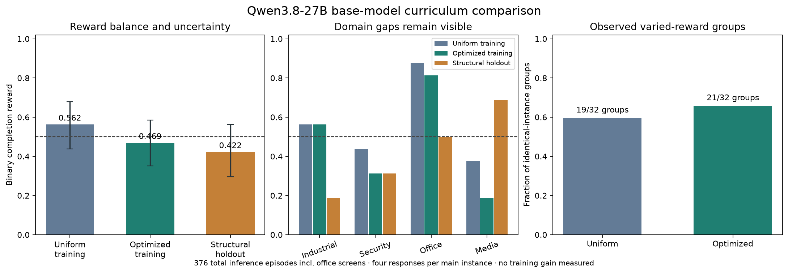

# Explicit learnability and diversity optimization

> Historical four-domain experiment. The current candidate is described in the [eight-domain iteration plan](iteration-eight-domains.md). Version 1 has finished: see its [postmortem](v1-postmortem.md). The measurements below refer to the earlier controller and are not results for the expanded candidate.

The next official submission must have measured reward variation, balanced
workflow coverage and held-out results. A mean of 0.5 alone is insufficient:
constant half-credit gives GRPO no within-group reward signal.

## Metrics and objective

| Objective | Measurement | Optimization or gate |
|---|---|---|
| Reward balance | Actual terminal reward mean, absolute distance from 0.5, cluster-bootstrap 95% interval | Target 0.5; initial fresh-pilot tolerance ±0.10 |
| Learnable variation | Reward variance; proportion of four-response groups with different rewards on the **same instance**; within-group variance | Prefer non-unanimous groups; initial pilot target ≥60% |
| Behavioral difficulty | Reward conditional on valid JSON; workflow failures separately from formatting, budget and inference failures | Redesign constraints when formatting supplies most failures |
| Domain coverage | Family proportions, effective family count and coverage of the eight Arena domains | Equal quotas across the four training families |
| Task coverage | Family/level entropy, effective cell count and observed cell counts | At least 10% selection probability for every level within its family |
| Skill coverage | Required operation/constraint tags and weighted pairwise Jaccard distance | Preserve different action and verification patterns; report these as design proxies |
| Structural generalization | Outcomes on untouched coefficients, stress relationships, dependency graphs, policy combinations and cue-window layouts | Keep results out of sampler fitting; inspect domain-specific gaps |
| Cross-domain generalization | Outcomes on science and finance workflows absent from training | Measure base capability now; require a trained-versus-base comparison to claim improvement |

For binary completion, variance is `p(1-p)`, maximized at `p=0.5`. This fact does
not guarantee the largest GRPO gradient or the greatest transfer. For four
independent samples of an identical instance, mixed-reward probability is
`1 - p^4 - (1-p)^4`. Heterogeneous-instance mixtures can overestimate useful
signal; the fresh experiment therefore measures actual identical-instance
groups rather than treating the mixture proxy as evidence.

The constrained optimizer maximizes expected mixed-reward probability plus an
entropy term, subject to equal family quotas, per-level floors and a predicted
mean of 0.5 whenever feasible. It reports the reachable mean interval when the
target is infeasible. Calibration uncertainty and subsequent policy changes
can make predictions inaccurate; terminal observations update discounted
counts, while held-out evaluations never update them.
The entropy term applies to the probability remaining after coverage floors;
the report also measures entropy of the complete task distribution. A sweep of
entropy weights records the trade-off with predicted mixed-group probability.

| Entropy weight | Predicted mean | Predicted mixed-group probability | Normalized cell entropy |
|---:|---:|---:|---:|
| 0.02 | 0.500 | 0.777 | 0.883 |
| 0.12, tested | 0.500 | 0.762 | 0.940 |
| 0.25 | 0.500 | 0.748 | 0.958 |

These are training-calibration predictions, not fresh results for every setting.
The [full trade-off sweep](curriculum-pareto.json) makes the coverage-versus-signal
choice explicit. The next comparison can test whether stronger entropy preserves
more observed diversity without losing the useful reward band.

## Baseline and separate candidate

The previous fractional-reward candidate produced a training mean of **0.774**
on 96 Qwen3.8-27B episodes, with full-success probability **0.604**. Under the
new coverage constraints, its measured cells can only reach a predicted mean
of **0.648–0.903**. Reweighting alone cannot meet the requested target.

The new experimental candidate changes the objective explicitly: reward is one
only when every necessary behavioral check passes on a fresh process artifact,
and zero otherwise. Individual diagnostics remain available. This is a separate
reward definition, not an equivalent rescaling of the old result. Retrospective
joint-completion projections inform its initial sampler, but fresh model
rollouts are required before accepting it. The older public image and dataset
still describe the fractional-reward candidate and have not been relabeled.

## IridisX experiment

H200 job **1788332** uses the pinned bf16 Qwen3.8-27B model, thinking disabled,
temperature 1.0, 16,384-token context and an 8,192-token episode allowance.
The controller and experiment sources are archived locally before measurement.
The job completed successfully in **21 minutes 43 seconds**, including the
separate office screens on the same allocation. The H200 has been released.

1. **Uniform control:** four families × eight fresh instances × four responses
   = 128 training episodes.
2. **Optimized sampler:** the same family/seed allocation and four responses,
   using frozen training-only calibration weights = 128 episodes. Difficulty
   can differ between arms, but every group within an arm repeats one identical
   instance. This measures selection effects, not a policy-training improvement.
3. **Structural holdout:** four families × four new instances × four responses
   = 64 episodes. Holdouts change the stress relationship, introduce a branching
   scheduling graph and shuffled inputs, combine inactive/external identities,
   and use nonuniform caption windows.
4. **Unseen-domain probes:** science and finance × three settings × four fresh
   instances = 24 episodes. Science executes a reproducible fit with filtering,
   intercepts and unit conversion. Finance posts and closes a ledger with
   settlement, reversals and foreign exchange. Neither family trains the sampler.

Infrastructure failures are unscored and reported. Formatting failures are
scored failures with a separate rate. Confidence intervals resample independent
instances with their repeated responses together. Per-domain results are
reported so an acceptable aggregate cannot hide a saturated or failing family.

## Measured results

| Metric | Uniform training | Optimized training |
|---|---:|---:|
| Episodes | 128 | 128 |
| Actual mean reward | 0.5625 | 0.46875 |
| Absolute distance from 0.5 | 0.0625 | 0.03125 |
| Instance-bootstrap 95% interval for mean | 0.438–0.680 | 0.352–0.586 |
| Varied-reward identical-instance groups | 19/32 (59.4%) | 21/32 (65.6%) |
| Varied groups with all four replies valid JSON | 14/26 | 15/23 |
| Formatting failure rate | 6.25% | 10.94% |
| Effective domain count | 4.00 | 4.00 |
| Effective family/level cell count, maximum 12 | 11.25 | 9.25 |
| Observed cells | 12/12 | 11/12 |

All four training domains have exactly 32 episodes in each arm. The optimized
point estimate is closer to 0.5, but the post-hoc paired bootstrap interval for
the change in target error is **−0.148 to +0.086**, which contains zero. This is
preliminary selection evidence, not an established improvement. Sampling also
concentrated the finite sample more and increased formatting failures. The
10% probability floor does not guarantee that every cell appears in eight draws
per family.

The structural holdout mean is **0.4219** over 64 episodes, with varied rewards
in 13/16 identical-instance groups. Industrial scores only **0.1875** on its
holdout, while the legacy office training mean remains **0.8125**. Differences
include both new structure and sampled difficulty composition; they are
descriptive results, not a controlled attribution to a particular shift.

The unseen science/finance probes score **24/24** with the base model. Three
levels share each seed, giving eight independent family/seed bundles. All-pass
bundles have a Wilson interval of approximately **0.676–1.000**. A percentile
bootstrap on all-one rewards is degenerate and does not establish perfect
population success. More importantly, these probes have no measured headroom
for demonstrating training gains; stronger sealed transfer tests are needed.

The separate scheduling screen changes both structure and interface. A
full-calendar interface scores **2/8** at level 2, with two formatting failures;
an incremental booking interface on the matched inputs scores **6/8**, with no
formatting or budget failures. Its two failures are behavioral. This is a useful
small pilot for the next candidate, not a replacement for broader calibration.
The full-list level 1 fails mostly on formatting and should not be selected
merely because its mean is low. All **376** inference episodes across the main
comparison and office screens have zero inference failures.

The [aggregate machine-readable report](curriculum-metrics.json) contains full
domain/cell measurements, selection weights, provenance, uncertainty and quality
gaps. Model replies, seeds, expected outputs and grader source stay private.

## Decision and remaining work

Before release, promote and calibrate the incremental office interface across
all settings, address security formatting, and preserve more structural variety
in training cases. Test a stronger entropy weight or randomized coverage blocks
on new training seeds; compare the resulting mean, actual within-instance
variation and diversity rather than choosing weights from prediction alone.
Use a new holdout partition with matched difficulty allocation and discriminative
cross-domain probes. The current results leave these quality gates open.

If fresh reward balance or identical-instance variation misses the pilot band,
update training-only priors or redesign the failing constraints and confirm on
new training seeds. Do not optimize against structural or unseen-domain holdouts.
Entropy and skill distance prevent curriculum collapse; they do not prove that
the trained model generalizes.

The decisive transfer experiment compares the same base model with a locally
trained policy on a new, sealed evaluation partition. A balanced-curriculum
control and an optimized curriculum should receive matched training budgets.
Report overall and per-domain reward changes, uncertainty, format changes and
regressions. A custom multi-turn rollout is supported by the
[TRL GRPO trainer](https://huggingface.co/docs/trl/grpo_trainer); a local pilot
must document its differences from the Arena's fixed, unpublished recipe.
**No local trained-versus-base gain has been measured yet.**

After passing the gates, freeze source-private controller hosting, rebuild the
proxy with its exact revision, publish the updated visible dataset and aggregate
report, and replay the actual public image. Keep graders, reference policies,
model traces and credentials out of the agent image. Show the exact submission
JSON and wait for fresh approval before using the rolling 24-hour account slot.
